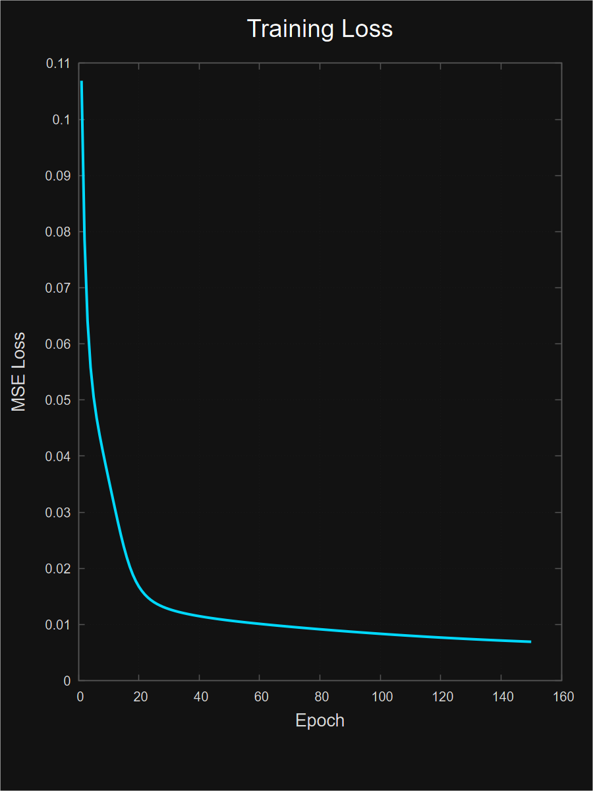

## Tyre-Sync

###### An ML-Based Predictive Tyre Health Monitoring System and Predictive Failure Detection System

---

  <ul style="list-style: none">
    

      <h2>Neural Stats</h2>
    

  </ul>

The network uses a Multi-Layer Perceptron (MLP) architecture  
configured with a `29 -> 32 -> 16 -> 1` topology.  
The output represents the normalized `tyre_health_score` (0 to 1). 

- **Training Dataset size**: 19,128 samples (80%)
- **Testing Dataset size**: 4,872 samples (20%)
- **Epochs Trained**: 150
- **Final Training MSE Loss**: `6.93e-03`

---

> Note: The AI Recommendations shown in the demo are hardcoded dialogs based on predefined threshold rules

 

Project Reference & Credits (Expand)

### Powered By
*   **MLP C Engine**: Powered by px7nn's header-only [MLP.h Library](https://github.com/px7nn/MLP.h) for fast, dependency-free C neural network initialization and file loading.
*   **3D Truck Model**: Features the low-poly [MAN TGS-E Truck Model](https://sketchfab.com/3d-models/ftrc-man-tgs-e-614f34c4e3e441b5b1233aba3bf65e5a) designed by Luo3D on Sketchfab.

### File Tree Guide
*   `/dataset/`: Preprocessed CSV matrices and reference thresholds parameters details.
*   `/model/`: Original neural network C training codes, MLP core library, and trained weight values.
*   `/python/`: Feature scalers parsing utilities and dataset generators.
*   `/static/`: WebAssembly compiled binaries (`.wasm`/`.js`/`.data`) and the 3D model assets.
*   `/index.html`: Main visual dashboard application.

